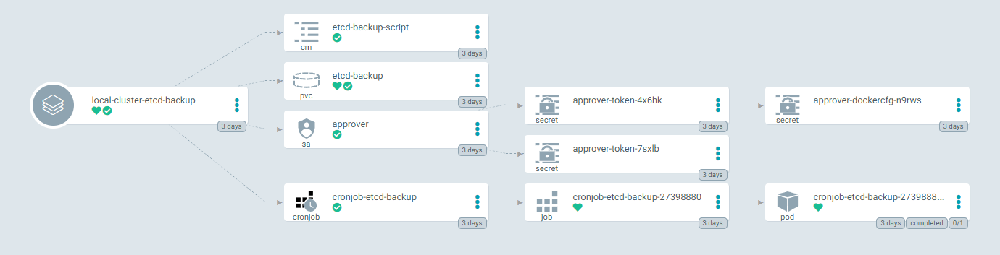
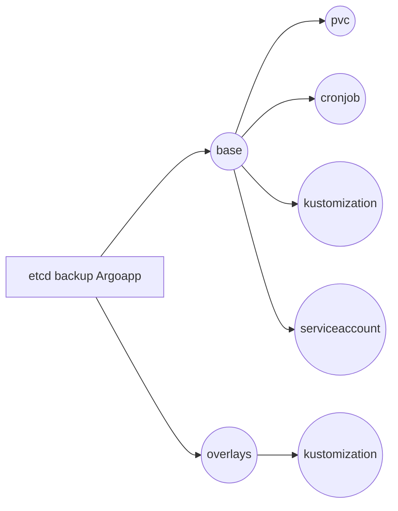

# Kustomize 

This document will be used to display common best practices in kustomize and a small explanation on how to use this technology.


# Terminology

Firstly we should get you familiar with the terms that are used in kustomize.

- Base - Basically the common templates and files used in your application, this is used for allowing kustomize to be kept DRY (dont repeat yourself principle).
- Overlay - This will hold the more specific configuration which isn't reusable, cluster specific/environment specific/etc...
- Kustomization files - Describe what resources to use, will be found in base and overlays alike.

I will be using this following example to explain about the file hierarchy - 
https://github.com/michaelkotelnikov/gitops-cluster-configuration/tree/master/etcd-backup
```
etcd-backup
└───base
│   ├──configmap.yaml
│   ├──cronjob.yaml
│   ├──kustomization.yaml
│   ├──pvc.yaml
|	└──serviceaccount.yaml
└───overlays
	├───local-cluster
	|	└──kustomization.yaml
	└───ocp49-test
		└──kustomization.yaml
```
As can be seen, the base contains several kubernetes resources which will be reused across clusters, adhearing to the DRY principle. 
```
apiVersion: kustomize.config.k8s.io/v1beta1
kind: Kustomization

namespace: etcd-backup

resources:
  - configmap.yaml
  - cronjob.yaml
  - pvc.yaml
  - serviceaccount.yaml
```
The overlays contain kustomization files which in turn deploy the resources used in the base, as this application has no cluster specific changes it is simply deployed to each cluster via the kustomization file.
```
apiVersion: kustomize.config.k8s.io/v1beta1
kind: Kustomization

resources:
  - ../../base
```

This is what the deployment will look like in Argocd for local-cluster.


## Common best practices
1. Keep custom resources and their instances in seperate packages, otherwise race conditions might be encountered.
2. Keep common resources in the base file, always ask yourself will this resource be reused? before placing it outside of the base file.
3. Organize your resources by kind, using the following naming convention: lowercase-hypenated.yaml (e.g., horizontal-pod-autoscaler.yaml). Place services in the service.yaml file.
4. Stick to the standard directory structure! using bases/ for base files and overlays/ for environment-specific files.
5. While developing or before pushing to git, run kubectl kustomize cfg fmt file_name to format the file and set the indentation right.

## The philosophy
Kustomize is very much like kubernetes, totally declarative, whatever you wrote that you want is what the system will give it to you. Similarly to Docker so does Kustomize work with layers, enabling you to create a base and add on top of the previous layers thus saving adding complexity to your configuration.


## Ignore this for now
And this will produce a flow chart:

A simple graph to visuallize all the resources as they will be "deployed"


